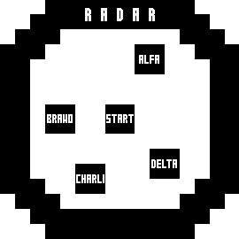

# Points Radar (GPS)

Shows selected points around current position. Aimed to give navigation ability for watches without maps and courses.

* Fonts are very small, to fit as many points as possible.
* Each point has distance in straight kilometers from current position (ultra small font).
* Points locations are entered in sync app, each point can be named.
* Point "s" is auto added at activity start location.
* 10 km radius, points within range are placed according to distance, further at the edge.
* Distances refresh about every 10 seconds (counter `c` var) and only when datafield is visible (auto call `onUpdate()` function), to reduce calculations.
* The Radar rotates, points are shown about in their directions.




## Usage
### Enter Points
* Point format is: `latitude,longitude,name` - separated by comma `,`
* Latitude and longitude must use dot `.` as decimal separator
* Name is optional
* Example: `##.######,##.######,alfa` or `##.######,##.######`
### Suggestions
* Use very short names, to keep the Radar readable.
* Choose points with some distance between. Points too close, can overlap.
* If points overlap anyway - turn around, this changes their positions and could be easier to see them.
### Run
* Copy compiled `Points.prg` to the `APPS\` directory.
* Select: `Activity Settings` → `Data Screens` → `Screen #` → `Field #` → `Connect IQ` → `Points`.


## Compile
### Points.prg
```
monkeyc -y dev_key.der -f PointsRadarGPS\monkey.jungle -r -o Points.prg
```
### dev_key.der
```
openssl genrsa -out dev_key.pem 4096
openssl pkcs8 -topk8 -inform PEM -outform DER -in dev_key.pem -out dev_key.der -nocrypt
```


## Optimization
### Points_opt.mc
Size can be slightly reduced by hardcoding:
* text color: `dc.setColor(0x000000,-1);`
* x and y (screen center): `xp=107+...` and `yp=90+...` and `dc.fillRectangle(107, 90,...);`
* r (radius): `maxr=82/...` and `rr=82;`
* settings array (points): `set=["##.######,##.######,alfa", "##.######,##.######"];`